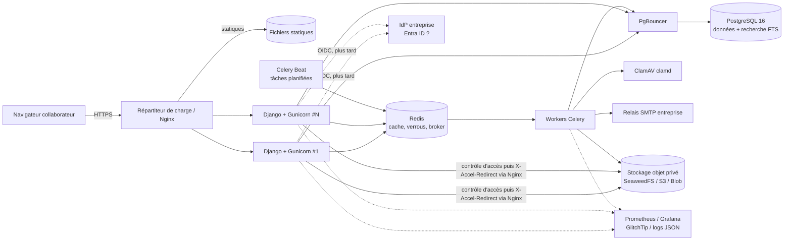
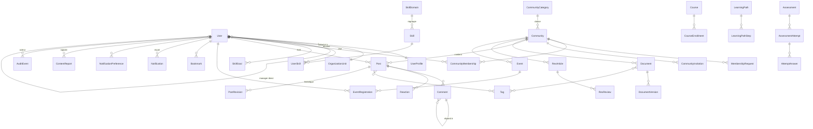

# Plateforme Communautés TALAN — Document de cadrage (étape 1)

> Statut : **proposition à valider** · Date : 2026-10-09 · Aucune ligne de code n'a encore été écrite.
> Ce document répond au point 28 du prompt maître. Les décisions marquées **[À VALIDER]** sont regroupées en section 13.

---

## 1. Synthèse de la vision produit

La plateforme est **l'espace de référence interne** où un collaborateur TALAN trouve sa communauté, la connaissance fiable qu'elle produit, et le chemin pour progresser. Elle n'est pas un réseau social généraliste : chaque interaction (publication, REX, question, événement, quiz) sert le **partage de connaissance** ou la **montée en compétences**.

Trois promesses structurent le produit :

| Pour qui | Promesse | Indicateur de succès (à mesurer, pas à promettre) |
|---|---|---|
| Collaborateur | « En 2 minutes je trouve la communauté, la ressource ou la formation dont j'ai besoin, et je vois où j'en suis. » | Taux de collaborateurs membres d'≥ 1 communauté ; recherches aboutissant à un clic |
| Responsable de communauté | « J'anime, je structure et je mesure ma communauté sans outil annexe. » | Communautés avec ≥ 1 contribution/semaine ; délai de traitement des demandes d'adhésion |
| Manager / Direction | « Je vois les compétences et besoins de formation de mon équipe, en agrégé et dans le respect de la vie privée. » | Objectifs de compétences définis ; participation aux formations |

Principe directeur : **peu de fonctionnalités, mais réellement opérationnelles** (persistées, autorisées côté serveur, testées, documentées).

---

## 2. Hypothèses fonctionnelles retenues

Hypothèses prises par défaut pour avancer ; chacune est réversible sauf mention contraire.

| # | Hypothèse | Pourquoi | Réversible ? |
|---|---|---|---|
| H1 | Interface **en français**, code et textes passés par le système i18n de Django (anglais ajoutable sans refonte). | Talan est d'origine française ; coût d'i18n quasi nul si fait dès le départ. | Oui |
| H2 | **Authentification locale sécurisée au MVP**, architecture prête pour **OIDC** (Microsoft Entra ID très probable) via `mozilla-django-oidc`. Le compte est identifié par l'e-mail professionnel. | Pas d'accès à l'IdP Talan pour l'instant ; ne doit pas bloquer le développement. | Oui (D2) |
| H3 | Un collaborateur appartient à **une unité organisationnelle** et a **au plus un manager direct** (relation hiérarchique simple, importée plus tard depuis l'annuaire). | Suffisant pour les droits manager ; matrices complexes plus tard. | Oui |
| H4 | Trois **modes d'accès** de communauté : *ouverte* (adhésion libre), *sur demande* (validation), *sur invitation* (privée, invisible des non-membres sauf titre si configuré). | Couvre le § 4.1. | Oui |
| H5 | Le **contenu publié** (post, REX, document) appartient à une communauté ; il hérite de sa visibilité, sauf restriction plus forte au niveau de l'objet. | Modèle d'autorisation lisible et testable. | Coûteux à changer |
| H6 | Les fichiers sont dans un **stockage objet privé** (SeaweedFS en dev, S3-compatible managé en prod). Aucune URL publique ; téléchargement via l'application qui vérifie le droit puis délègue l'envoi à Nginx (**X-Accel-Redirect**, emplacement interne) : aucune URL de stockage n'est exposée. | Exigence § 5. | Oui |
| H7 | Les **résultats détaillés** de quiz et l'autoévaluation sont **privés par défaut** ; le manager voit les données **agrégées** de son équipe et, individuellement, uniquement ce que le collaborateur a choisi de partager (compétences déclarées, objectifs, formations suivies). | Exigence § 3.3 + RGPD (minimisation). | Oui (D6) |
| H8 | **Pas de temps réel (WebSocket)** au MVP : notifications in-app rafraîchies par HTMX (polling léger 60 s) + e-mails asynchrones. Django Channels seulement si un besoin réel apparaît. | § 15 « temps réel uniquement si justifié ». | Oui |
| H9 | Le **mentorat**, l'IA, l'intégration Teams et la synchronisation annuaire sont **hors MVP**. | Valeur à confirmer (§ 23). | Oui |
| H10 | Les badges éventuels sont **non compétitifs** (pas de classement nominatif). | § 23, éviter les comparaisons trompeuses. | Oui |
| H11 | Un « **utilisateur actif** » = a effectué au moins une action authentifiée (page vue comprise) sur la période ; on distingue **actif** (consulte) et **contributeur** (publie, commente, répond). Périodes : jour (DAU), 7 j (WAU), 28 j (MAU). | § 13 demande une définition précise. | Oui |
| H12 | Aucune donnée personnelle réelle hors production ; jeux de démonstration générés (Faker, fr_FR). | § 21, § 26.13. | Non négociable |
| H13 | **Identité visuelle** : en l'absence de charte officielle fournie, on utilise un thème neutre piloté par des *design tokens* CSS (couleurs, typographie) et un **emplacement de logo** ; aucun logo Talan inventé. | § 14. | Oui (D4) |

---

## 3. Principaux parcours utilisateurs

**P1 — Premier pas du collaborateur.** Connexion → page d'accueil vide guidée (« Choisissez 3 centres d'intérêt ») → suggestions de communautés expliquées (« car vous avez indiqué *Cloud* ») → adhésion en un clic à une communauté ouverte → le flux d'accueil se remplit.

**P2 — Trouver une ressource fiable.** Recherche globale « dbt incremental » → résultats filtrés par droits, termes surlignés, facettes (type, communauté, date) → ouverture du document : métadonnées, version de référence, auteur → téléchargement (contrôlé, tracé) ou ajout aux favoris.

**P3 — Rejoindre une communauté privée.** Page communauté (titre et description visibles) → « Demander à rejoindre » + motivation → notification au responsable → acceptation → notification au demandeur → accès au contenu.

**P4 — Publier un REX.** « Nouveau REX » → choix d'un modèle (contexte, problème, approche, résultats, enseignements) → brouillon auto-sauvegardé → **contrôle automatique** (détection de secrets, e-mails, noms de clients de la liste sensible) → soumission en revue → validation par un expert/modérateur → publication et notification aux membres.

**P5 — Animer une communauté (responsable).** Tableau de bord : demandes en attente, questions sans réponse, contenus signalés, contenus à réviser → traitement en lot → création d'un événement avec capacité et liste d'attente → épinglage d'une annonce.

**P6 — Événement.** Calendrier → atelier « Terraform avancé » (20 places) → inscription → confirmation + fichier .ics → rappel J-1 (Celery) → désistement d'un inscrit → **promotion automatique** du premier en liste d'attente, notifiée.

**P7 — Montée en compétences (release 2).** Parcours « Data Engineer Azure » → modules ordonnés avec prérequis → progression calculée côté serveur → test blanc chronométré, réponses sauvegardées à chaque question, soumission idempotente → résultat, axes de progression → attestation interne (clairement distincte d'une certification officielle).

**P8 — Manager.** Vue équipe : compétences déclarées agrégées, lacunes vs objectifs, participation aux formations → proposition d'un objectif d'apprentissage à un collaborateur → export CSV autorisé (tracé dans l'audit).

**P9 — Administration.** Admin fonctionnel : gestion des catégories (sans code), suspension d'une communauté, file des signalements, journal d'audit filtré. Admin technique : espace distinct (`/ops/`), MFA obligatoire, sans accès au contenu métier par défaut.

---

## 4. Matrice des rôles et permissions

### 4.1 Modèle à deux niveaux

1. **Rôles globaux** (portée plateforme) : implémentés avec les `Group` + `Permission` Django, administrables sans code.
2. **Rôles de communauté** (portée objet) : champ `role` sur `CommunityMembership`.

Toute décision d'accès passe par une **couche de politiques unique** (`core/policies/`) : des fonctions pures `can(user, action, obj) -> bool`, utilisées par les vues HTML, l'API DRF, les querysets (`visible_to(user)`) et la recherche. Les templates n'affichent un bouton que si `can()` est vrai, **mais le serveur revérifie systématiquement**. Chaque politique a ses tests (matrice rôle × action × état).

### 4.2 Rôles globaux

| Rôle | Description | Remarques |
|---|---|---|
| En attente d'activation | Compte créé, non activé | Aucun accès hors profil/aide |
| Collaborateur | Rôle de base de tout employé actif | — |
| Manager | Collaborateur + vue sur ses rapports directs | Défini par la relation hiérarchique, pas attribué à la main |
| Responsable formation | Gère catalogue formations, parcours, certifications | — |
| Créateur de communautés | Autorisé à créer une communauté | Sinon la création passe par une demande à l'admin |
| Admin fonctionnel | Utilisateurs, rôles, communautés, catégories, modération globale, audit fonctionnel | Pas d'accès aux réglages techniques |
| Admin technique | Intégrations, sécurité, supervision | Pas de droits fonctionnels implicites ; MFA ; actions tracées |
| Auditeur | Lecture seule sur audit et statistiques globales | Aucun contenu privé |

### 4.3 Rôles de communauté

Membre < Contributeur < Expert < Modérateur < Animateur < Responsable (chaque rôle hérite du précédent). Formateur est un attribut d'une formation/événement, pas un rôle de communauté.

### 4.4 Matrice (✓ autorisé · ◐ sous condition · — interdit)

| Action | Non-membre | Membre | Contributeur | Expert | Modérateur | Animateur | Responsable | Manager | Admin fonct. | Admin tech. | Auditeur |
|---|---|---|---|---|---|---|---|---|---|---|---|
| Voir une communauté ouverte et son contenu | ✓ | ✓ | ✓ | ✓ | ✓ | ✓ | ✓ | ✓ | ✓ | — | ✓ (méta) |
| Voir le contenu d'une communauté privée | — | ✓ | ✓ | ✓ | ✓ | ✓ | ✓ | — | ◐ ¹ | — | — |
| Adhérer / demander l'adhésion | ✓ | — | — | — | — | — | — | — | — | — | — |
| Publier un post / poser une question | — | ✓ | ✓ | ✓ | ✓ | ✓ | ✓ | — | — | — | — |
| Déposer un document | — | ◐ ² | ✓ | ✓ | ✓ | ✓ | ✓ | — | — | — | — |
| Publier un REX (après revue) | — | ✓ | ✓ | ✓ | ✓ | ✓ | ✓ | — | — | — | — |
| Valider un REX / une compétence | — | — | — | ✓ | ✓ | ✓ | ✓ | — | ✓ | — | — |
| Modérer (masquer, archiver) | — | — | — | — | ✓ | ✓ | ✓ | — | ✓ | — | — |
| Épingler, publier une annonce | — | — | — | — | — | ✓ | ✓ | — | ✓ | — | — |
| Créer un événement | — | — | — | ✓ | — | ✓ | ✓ | — | ✓ | — | — |
| Gérer membres, rôles, demandes | — | — | — | — | — | ◐ ³ | ✓ | — | ✓ | — | — |
| Configurer / archiver la communauté | — | — | — | — | — | — | ✓ | — | ✓ | — | — |
| Statistiques agrégées communauté | — | — | — | — | — | ✓ | ✓ | — | ✓ | — | ✓ |
| Voir résultats détaillés d'un quiz d'autrui | — | — | — | — | — | — | — | ◐ ⁴ | — | — | — |
| Voir compétences d'un collaborateur | ◐ ⁵ | ◐ ⁵ | ◐ ⁵ | ◐ ⁵ | ◐ ⁵ | ◐ ⁵ | ◐ ⁵ | ◐ ⁴ | ✓ | — | — |
| Gérer catégories / taxonomies | — | — | — | — | — | — | — | — | ✓ | — | — |
| Consulter le journal d'audit | — | — | — | — | — | — | — | — | ◐ ⁶ | ◐ ⁶ | ✓ |
| Paramètres techniques / intégrations | — | — | — | — | — | — | — | — | — | ✓ | — |

1. Uniquement via un motif saisi (modération, signalement) et tracé dans l'audit.
2. Si la communauté autorise le dépôt par les membres (paramètre).
3. Accepter/refuser les demandes ; pas de modification des rôles Animateur/Responsable.
4. Manager : uniquement pour ses rapports directs et uniquement ce que le collaborateur a partagé ; les scores détaillés restent privés sauf consentement explicite (H7).
5. Selon la visibilité choisie par le collaborateur dans son profil (privé / communauté / toute l'entreprise).
6. Admin fonctionnel : événements fonctionnels ; admin technique : événements techniques et de sécurité.

---

## 5. Architecture technique proposée et justification

**Style : monolithe modulaire Django**, une seule base de code déployable, découpée en applications métier aux frontières explicites (services, politiques). Raison : équipe réduite, cohérence transactionnelle forte (adhésions, inscriptions, tentatives), déploiement simple ; l'extraction d'un service reste possible plus tard (ex. recherche) si une mesure le justifie.

| Composant | Choix | Pourquoi | Alternative écartée |
|---|---|---|---|
| Langage / framework | Python 3.12, **Django 5.2 LTS** | Support long terme (jusqu'à avril 2028), imposé par le prompt | — |
| API | **DRF** + **drf-spectacular** (OpenAPI 3) | Documentation générée, réutilise les politiques | API GraphQL : inutile ici |
| Frontend | Templates Django + **Bootstrap 5.3** + **HTMX** ; JavaScript vanilla ponctuel ; **Chart.js** pour les graphiques | Rendu serveur rapide, accessible, peu de dépendances ; HTMX pour les interactions (réactions, filtres, sauvegarde de réponses) sans SPA | React/Vue : coût de maintenance et duplication des autorisations non justifiés |
| Base | **PostgreSQL 16** | Intégrité, recherche plein texte (`tsvector`, config `french`, `unaccent`, `pg_trgm`) | — |
| Pool de connexions | **PgBouncer** (mode transaction) en prod | Contrôle des connexions avec plusieurs instances Gunicorn + Celery | — |
| Cache / broker | **Redis 7** | Cache, verrous, limitation de débit, broker Celery | RabbitMQ : un composant de plus sans gain au MVP |
| Tâches asynchrones | **Celery 5** + Celery Beat | E-mails, scan antivirus, prévisualisations, rappels, agrégats analytiques | — |
| Stockage fichiers | **django-storages (S3)** ; **SeaweedFS** en dev (MinIO n'est plus distribué sur Docker Hub) | Abstraction compatible S3 / Azure Blob (via backend dédié) | Fichiers en base : exclu |
| Antivirus | **ClamAV** (`clamd`) appelé par Celery ; fichier en *quarantaine* tant que non analysé | § 5 « détection de fichiers malveillants » | Service SaaS : envoie des fichiers internes à l'extérieur |
| Serveur | **Gunicorn** (WSGI) derrière **Nginx** | Éprouvé ; pas d'ASGI tant qu'il n'y a pas de temps réel | Uvicorn/ASGI : seulement si Channels |
| SSO | `mozilla-django-oidc` (prêt, activé quand l'IdP est disponible) | OIDC standard, compatible Entra ID | SAML : seulement si imposé |
| Sécurité | `argon2` (hash), `django-axes` (anti force brute), `django-csp`, `django-ratelimit`, `django-otp` (MFA admins) | Couvre § 18 avec des briques maintenues | — |
| Observabilité | Logs JSON (`structlog`), ID de corrélation, `django-prometheus`, SDK Sentry (compatible GlitchTip auto-hébergé) | § 20 ; GlitchTip évite d'envoyer des erreurs hors de l'entreprise | — |
| Tests | `pytest`, `pytest-django`, `factory_boy`, Playwright (parcours), **Locust** (charge) | Locust est en Python : même langage que l'équipe | k6 : bon aussi, mais JavaScript |
| Qualité / CI | Ruff (lint + format), mypy (progressif), `pip-audit`, Bandit, Trivy (images), gitleaks | § 21 | — |
| Dépendances | **uv** + `pyproject.toml` + fichier de verrouillage | Reproductible et rapide | pip-tools : équivalent |
| Déploiement | Images Docker ; Compose pour dev/test ; **Kubernetes ou service de conteneurs managé** en préprod/prod (selon D1) | Compose n'est pas une solution HA | — |

### Décisions d'implémentation clés

- **Couche services** : toute écriture métier passe par `app/services.py` (transaction, contrôle de politique, audit, événement de notification). Les vues restent fines.
- **Audit** : `AuditEvent` écrit dans la même transaction que l'action privilégiée (append-only, pas de suppression via l'application).
- **Notifications** : un service `notify(event_type, recipients, target)` crée des `Notification` en base ; Celery envoie les e-mails selon les préférences et regroupe en résumé (digest) quotidien les catégories non urgentes.
- **Idempotence** : soumission de quiz et inscription à un événement protégées par contraintes d'unicité + `select_for_update` + clé d'idempotence côté formulaire.
- **Recherche** : colonne `search_vector` maintenue par trigger/`SearchVectorField` + index GIN par type de contenu ; une vue de recherche unifiée interroge chaque type via son queryset `visible_to(user)` (les droits sont appliqués **avant** le classement, jamais en post-filtrage d'une page).

---

## 6. Diagramme d'architecture



---

## 7. Diagramme entité-relation initial (MVP + socle formation)

Conventions : clé primaire `id` (bigint), `public_id` UUID exposé dans les URL (pas d'identifiants séquentiels devinables), `created_at`/`updated_at` partout, **archivage logique** (`archived_at`) plutôt que suppression pour le contenu ; suppression physique réservée aux demandes RGPD (anonymisation des auteurs).



### Contraintes et index principaux

| Entité | Contraintes d'unicité / intégrité | Index | Règle de suppression |
|---|---|---|---|
| `User` | `email` unique (insensible à la casse, `citext` ou index `Lower`) | email | Désactivation ; anonymisation RGPD |
| `CommunityMembership` | unique (`community`, `user`) ; `role` ∈ énumération | (`user`, `community`), (`community`, `role`) | Départ = suppression de la ligne + audit |
| `MembershipRequest` | une seule demande `pending` par (`community`, `user`) (index unique partiel) | (`community`, `status`) | Conservée 12 mois puis purgée |
| `Community` | `slug` unique | `category`, `access_mode`, GIN `search_vector` | Archivage (`archived_at`), jamais `CASCADE` sur le contenu |
| `Post` | FK `community` `PROTECT` ; `kind` ∈ {discussion, question, annonce, article} | (`community`, `-created_at`), (`pinned`), GIN `search_vector` | Archivage ; masquage par modération |
| `Comment` | profondeur limitée à 2 niveaux (validation service) | (`post`, `created_at`) | Masquage |
| `Reaction` | unique (`user`, `post`, `kind`) | (`post`) | `CASCADE` avec le post |
| `Document` | une seule `DocumentVersion` de référence (index unique partiel `is_reference = true`) | (`community`, `type`), GIN `search_vector` | Archivage + expiration (`expires_at`) |
| `DocumentVersion` | `storage_key` unique ; `sha256`, `size`, `mime`, `scan_status` | (`document`, `-created_at`) | Objet S3 supprimé par tâche après rétention |
| `Event` | `capacity ≥ 0` (CHECK) ; `ends_at > starts_at` (CHECK) ; stocké en UTC + `timezone` | (`community`, `starts_at`) | Annulation (`cancelled_at`) |
| `EventRegistration` | unique (`event`, `user`) ; `status` ∈ {inscrit, attente, annulé, présent} | (`event`, `status`, `created_at`) | Conservée pour l'historique |
| `AssessmentAttempt` | unique (`assessment`, `user`, `attempt_no`) ; `idempotency_key` unique | (`user`, `assessment`) | Conservée selon politique de rétention |
| `Notification` | — | (`recipient`, `read_at`, `-created_at`) | Purge après 90 jours |
| `AuditEvent` | append-only (pas d'UPDATE/DELETE via l'app) | (`actor`, `created_at`), (`target_type`, `target_id`) | Rétention 1 an (à valider avec la DSI) |

Pas de champ JSON générique à la place de relations structurantes. Le JSON est réservé à des données réellement non structurées (ex. `AuditEvent.changes`, `Question.payload` spécifique au type de question).

---

## 8. Structure proposée du dépôt Git

```
talan-communities/
├── README.md
├── pyproject.toml / uv.lock
├── .env.example                 # aucune valeur secrète
├── docker/
│   ├── Dockerfile               # multi-stage, utilisateur non root
│   ├── nginx/                   # conf reverse proxy
│   └── entrypoint.sh
├── compose.yaml                 # dev : web, worker, beat, postgres, redis, s3 (SeaweedFS), clamav, mailpit
├── compose.test.yaml
├── src/
│   ├── config/                  # settings/{base,dev,test,prod}.py, urls, wsgi, celery
│   ├── core/                    # policies, middleware (corrélation), utilitaires, design system (templates de base, composants)
│   ├── accounts/                # User, profil, auth, OIDC, préférences de visibilité
│   ├── organizations/           # unités, rattachements, relation managériale
│   ├── communities/             # communautés, catégories, adhésions, invitations
│   ├── content/                 # posts, commentaires, réactions, tags, signalements, modération, REX, favoris
│   ├── documents/               # documents, versions, stockage, scan, prévisualisation
│   ├── events/                  # événements, inscriptions, liste d'attente, .ics
│   ├── learning/                # formations, parcours, progression, certifications   (release 2)
│   ├── skills/                  # référentiel, compétences déclarées/validées, objectifs (release 2)
│   ├── assessments/             # banque de questions, quiz, tentatives               (release 2)
│   ├── notifications/           # notifications, préférences, digests, e-mails
│   ├── search/                  # recherche unifiée
│   ├── analytics/               # indicateurs agrégés, tableaux de bord, exports
│   └── audit/                   # AuditEvent, consultation
│       (chaque app : models.py, services.py, policies.py, selectors.py, views.py, api/, forms.py, tasks.py, templates/, tests/)
├── tests/                       # e2e Playwright, tests de charge Locust
├── docs/
│   ├── architecture.md, database.md, security.md, performance.md, deployment.md, runbooks/
│   └── decisions/               # ADR
└── .github/workflows/ci.yml
```

`REX` est intégré à `content` (un type de contenu avec un workflow de revue), et `mentorship` / `integrations` seront créées quand elles seront utiles, pour ne pas multiplier les apps vides.

---

## 9. Backlog MVP et roadmap

### 9.1 MVP proposé (« Communautés & connaissance ») — lots livrables dans l'ordre

| Lot | Contenu | Critères d'acceptation (extraits) | Dépend de | Risques |
|---|---|---|---|---|
| **L0 Socle** | Dépôt, Django 5.2, settings par environnement, Docker Compose (Postgres, Redis, SeaweedFS, ClamAV, Mailpit), CI (Ruff, tests, pip-audit, build image), logs JSON + ID de corrélation, `/healthz` | `docker compose up` démarre tout ; CI verte ; aucune variable secrète dans le dépôt | — | Choix d'hébergement (D1) |
| **L1 Comptes & rôles** | User personnalisé (e-mail), login/logout, réinitialisation de mot de passe, anti force brute, profil, rôles globaux, couche `policies`, audit, MFA pour admins, pages 403/404/429/500 | Un compte en attente ne voit rien ; un collaborateur ne peut pas accéder à `/admin` (testé en HTTP, pas seulement dans l'UI) | L0 | — |
| **L2 Design system** | Gabarit de base, navigation adaptée au rôle, composants (cartes, états vides, toasts, formulaires accessibles), tokens de marque | Navigation clavier complète ; contraste AA vérifié (axe-core en CI) | L1 | Charte absente (D4) |
| **L3 Communautés** | Catégories administrables, catalogue filtrable, création/configuration, 3 modes d'accès, adhésion / demande / invitation / départ, rôles internes, page d'accueil communauté | Matrice § 4.4 testée ; une communauté privée n'apparaît jamais dans un résultat pour un non-membre | L1, L2 | — |
| **L4 Publications** | Posts (discussion, question, annonce), commentaires sur 2 niveaux, réactions, mentions, épinglage, historique des révisions, signalement, file de modération, favoris | Le masquage par un modérateur est audité ; un non-membre reçoit 404 sur un post privé | L3 | Spam / bruit |
| **L5 Documents** | Dépôt (taille max, liste blanche MIME vérifiée sur le contenu), scan ClamAV, quarantaine, versions + version de référence, métadonnées, tags, téléchargement via X-Accel-Redirect (Nginx), expiration, signalement « obsolète » | Un fichier infecté (EICAR) n'est jamais téléchargeable ; l'emplacement interne de Nginx n'est pas joignable de l'extérieur | L3 | Volume stockage |
| **L6 REX & articles** | Modèles de REX, brouillon auto-sauvegardé, détection de secrets/PII avant soumission, workflow revue → publication | Un REX contenant une clé AWS factice est bloqué en revue avec un message explicite | L4, L5 | Faux positifs du détecteur |
| **L7 Événements** | Calendrier global et par communauté, capacité, liste d'attente avec promotion automatique, annulation, rappels, export .ics, lien visio, fuseaux horaires | 2 inscriptions simultanées sur la dernière place → 1 inscrit + 1 en attente (test concurrent) | L3 | — |
| **L8 Notifications** | Centre in-app, préférences par catégorie, e-mails asynchrones, digest quotidien | Une requête web n'attend jamais l'envoi SMTP ; préférence « désactivé » respectée | L4, L7 | Délivrabilité SMTP |
| **L9 Recherche** | Recherche unifiée FTS français, surlignage, facettes, pagination, suggestions trigram, respect des droits | Aucun résultat d'une communauté privée pour un non-membre (test dédié) | L3–L7 | Pertinence |
| **L10 Tableaux de bord** | Accueil collaborateur personnalisé ; tableau de bord responsable (membres, actifs, contributions, demandes, questions sans réponse) ; tableau admin global | Indicateurs calculés selon les définitions H11 ; aucun indicateur individuel nominatif côté responsable | L3–L9 | Coût des agrégats (tâches Celery nocturnes) |
| **L11 Durcissement MVP** | Données de démo, tests Playwright des parcours P1–P6, Locust (scénario de référence), sauvegarde/restauration testée, documentation | Voir § 12 | Tout | — |

### 9.2 Roadmap après MVP

| Release | Contenu |
|---|---|
| **R2 — Apprentissage** | Référentiel de compétences (déclaré / autoévalué / validé), objectifs, catalogue de formations, parcours avec prérequis, progression persistée, moteur de quiz (choix unique/multiple, vrai/faux, réponse courte, ordonnancement, association, code), tests blancs chronométrés, attestations internes, tableau de bord manager |
| **R3 — Certifications & pilotage** | Catalogue de certifications, préparation, échéances, déclaration des certifications obtenues ; correction manuelle des réponses rédigées ; analyse des erreurs récurrentes ; exports CSV/PDF ; feuilles de présence et feedback d'événements ; événements récurrents |
| **R4 — Intégrations** | SSO OIDC en production, import/synchronisation annuaire, intégration calendrier et Teams, API documentées pour intégrations internes |
| **R5 — Collaboration avancée** | Mentorat, badges non compétitifs, recommandations explicables, modèles de communautés, archivage automatique des communautés inactives |
| **R6 — IA (optionnelle)** | Résumés et recherche sémantique, uniquement avec un modèle hébergé dans un périmètre validé par la sécurité, et sur les seuls contenus que l'utilisateur peut lire |

---

## 10. Stratégie de sécurité et de protection des données

**Référentiel visé** : OWASP ASVS niveau 2 pour les fonctions exposées ; OWASP Top 10 comme liste de contrôle en revue de code.

| Domaine | Mesures |
|---|---|
| Authentification | Argon2 ; politique de mot de passe (longueur ≥ 12, vérification contre mots de passe compromis en liste locale) ; `django-axes` (verrouillage progressif) ; MFA TOTP obligatoire pour admins ; SSO OIDC prêt |
| Sessions | Cookies `Secure`, `HttpOnly`, `SameSite=Lax` ; expiration d'inactivité 8 h ; rotation de session à la connexion ; invalidation à la désactivation du compte |
| Autorisation | Couche `policies` unique ; querysets `visible_to(user)` ; tests de matrice systématiques ; 404 (et non 403) pour un objet privé afin de ne pas révéler son existence |
| Entrées / sorties | Formulaires et serializers validés ; ORM (pas de SQL brut non paramétré) ; Markdown rendu puis nettoyé (`nh3`) ; CSP stricte avec nonce ; HSTS, `X-Content-Type-Options`, `Referrer-Policy`, `Permissions-Policy` |
| Fichiers | Bucket privé ; liste blanche de types vérifiée sur le contenu réel ; taille max configurable ; ClamAV ; quarantaine ; `Content-Disposition: attachment` pour les types non prévisualisables ; prévisualisations générées côté serveur, jamais d'HTML utilisateur servi en ligne |
| API | Authentification par session (même origine) ; jetons uniquement pour intégrations ; CORS fermé par défaut ; limitation de débit par utilisateur et par IP |
| Contenu sensible | Détection avant publication : secrets (motifs type clés cloud, jetons, chaînes de connexion), e-mails/téléphones, termes d'une **liste de clients sensibles administrable** ; blocage en revue, jamais de publication silencieuse |
| Secrets | Variables d'environnement / gestionnaire de secrets de l'hébergeur ; gitleaks en CI ; jamais dans les images ni les logs (filtrage des champs sensibles dans les logs) |
| Traçabilité | `AuditEvent` pour toute action privilégiée, export, changement de rôle, accès d'un admin à un contenu privé |
| Dépendances | `pip-audit`, Dependabot, Trivy sur les images ; mises à jour mensuelles |
| RGPD | Registre des traitements (finalités : animation des communautés, développement des compétences) ; minimisation (pas de date de naissance, pas de photo obligatoire) ; visibilité du profil choisie par l'utilisateur ; droit d'accès (export de ses données) et d'effacement (anonymisation des contributions) ; durées de conservation documentées ; **AIPD recommandée** pour les données de compétences et l'accès manager (à mener avec le DPO de Talan) |
| Incidents | Runbook : détection, confinement (désactivation de comptes, révocation des sessions), notification DPO/CNIL sous 72 h si violation de données personnelles |

---

## 11. Stratégie de performance (10 000 inscrits)

### 11.1 Hypothèses de charge (à confirmer par la mesure)

| Grandeur | Hypothèse | Raisonnement |
|---|---|---|
| Comptes enregistrés | 10 000 (cible de conception 20 000) | Marge × 2 |
| Actifs quotidiens (DAU) | 1 500 – 2 500 (15–25 %) | Outil interne non obligatoire |
| Heure de pointe | 30 % du DAU sur 1 h, soit ~750 sessions | Pics 9 h–10 h et 14 h |
| Utilisateurs simultanément actifs (même minute) | 250 – 500 | ~1 action/20 s par session active |
| Débit pointe | 50 – 100 req/s (pages + appels HTMX) | Marge × 2 : **dimensionnement à 200 req/s** |
| Pic exceptionnel | Ouverture d'inscriptions à un événement populaire : 1 000 utilisateurs en 2 min | Test spécifique de concurrence |
| Fichiers | ~ 50 000 documents × 5 Mo moyens ≈ 250 Go sur 3 ans | Taille max par fichier : 100 Mo (paramétrable) |
| Base de données | < 50 Go à 3 ans hors fichiers | Les notifications sont purgées |

**Nous ne prétendons pas supporter 10 000 connexions simultanées** : ce n'est pas l'hypothèse réaliste, et aucune mesure n'a encore été faite.

### 11.2 Objectifs mesurables initiaux (SLO à ajuster après les tests)

- Pages authentifiées : **p95 < 400 ms**, p99 < 1 s, à 200 req/s.
- Taux d'erreur 5xx < 0,5 % pendant le test de charge.
- Recherche : p95 < 600 ms.
- Aucun endpoint > 20 requêtes SQL (garde-fou testé avec `django-assert-num-queries`).

### 11.3 Leviers

Application sans état (sessions en base ou Redis, fichiers en S3) → **mise à l'échelle horizontale** derrière le répartiteur ; PgBouncer ; `select_related` / `prefetch_related` et sélecteurs dédiés ; pagination par curseur sur les flux ; cache Redis des fragments coûteux (compteurs, catalogue) avec invalidation par événement ; agrégats analytiques pré-calculés la nuit ; compression gzip/brotli au niveau Nginx ; statiques avec empreinte et cache long ; `statement_timeout` PostgreSQL ; limitation de débit ; tâches lourdes dans Celery.

### 11.4 Tests de charge

Locust, scénarios réalistes (70 % lecture de flux/communautés, 15 % recherche, 10 % documents, 5 % écriture), jeu de données de 20 000 comptes fictifs, montée progressive jusqu'au point de rupture ; rapport documentant goulots observés et limites de l'infrastructure testée (`docs/performance.md`).

---

## 12. Critères d'acceptation du MVP

Le MVP est accepté quand, **preuves à l'appui (tests automatisés ou procédure exécutée)** :

1. Un utilisateur se connecte, et n'accède qu'aux fonctions autorisées ; la matrice § 4.4 (périmètre MVP) est couverte par des tests HTTP.
2. Communautés : création, configuration, 3 modes d'accès, adhésion/demande/invitation/départ, rôles internes : persistés et testés.
3. Publications, commentaires, réactions, épinglage, signalement et modération fonctionnent et sont audités.
4. Documents stockés dans un bucket privé, scannés, versionnés ; aucun accès direct sans contrôle (test d'accès direct au bucket et à l'emplacement interne Nginx).
5. REX avec workflow de revue et détection de secrets.
6. Événements : capacité, liste d'attente, promotion automatique, annulation, .ics ; test de concurrence vert.
7. Notifications in-app et e-mails asynchrones selon les préférences.
8. Recherche unifiée respectant les droits.
9. Tableaux de bord collaborateur, responsable et admin calculés selon les définitions H11.
10. Migrations reproductibles depuis une base vide (vérifié en CI) ; aucune migration destructrice automatique.
11. CI verte : lint, tests (couverture ≥ 85 % sur `services` et `policies`), pip-audit, gitleaks, build d'image, contrôle d'accessibilité automatisé.
12. Parcours P1–P6 testés au navigateur (Playwright) sur mobile, tablette et ordinateur.
13. Sauvegarde PostgreSQL + stockage objet, **restauration testée** et documentée.
14. Test de charge exécuté avec rapport ; écarts aux SLO documentés.
15. README et guides permettant à un nouveau développeur de lancer le projet en moins de 30 minutes.

---

## 13. Risques, arbitrages et décisions à valider

### 13.1 Risques principaux

| Risque | Impact | Mitigation |
|---|---|---|
| Périmètre très large (≈ 15 modules) | Fonctionnalités inachevées | MVP resserré, lots verticaux complets, roadmap explicite |
| Adoption faible (plateforme « de plus ») | Échec produit | Commencer par 3–5 communautés pilotes réelles ; mesurer |
| Fuite d'informations clients dans les REX | Juridique, réputation | Détection + revue obligatoire + liste de clients sensibles |
| Accès manager perçu comme surveillance | Rejet, RGPD | Agrégé par défaut, partage choisi par le collaborateur, AIPD |
| Absence d'IdP au démarrage | Comptes locaux à gérer | OIDC prêt, bascule sans migration de données |
| Faux positifs du détecteur de secrets | Frustration | Message explicite, revue humaine, liste d'exceptions |
| Hébergement non défini | Retard de mise en production | Conteneurs agnostiques, choix du stockage via configuration |

### 13.2 Décisions structurantes à valider

| # | Décision | Proposition par défaut |
|---|---|---|
| **D1** | Hébergement cible de la production (Azure, AWS, GCP, on-premise Kubernetes) | Conteneurs agnostiques ; je suppose **Azure** (stockage Blob, PostgreSQL Flexible Server) si Talan est sur Microsoft 365 |
| **D2** | Fournisseur d'identité | Auth locale au MVP, OIDC Entra ID activable dès que l'accès est donné |
| **D3** | Périmètre du MVP | « Communautés & connaissance » (§ 9.1) ; apprentissage et quiz en R2 |
| **D4** | Charte graphique officielle (logo, couleurs, typographie) | Thème neutre à tokens en attendant ; à remplacer dès réception |
| **D5** | Langues | Français uniquement, prêt pour l'i18n |
| **D6** | Règle d'accès manager aux données individuelles | Agrégé par défaut ; individuel = rapports directs + données partagées par le collaborateur ; scores détaillés jamais sans consentement |
| **D7** | Dépôt Git du code | Nouveau dépôt GitHub (à créer ou à rattacher à ce projet) |
| **D8** | Durées de conservation (audit, notifications, demandes) | Audit 1 an, notifications 90 j, demandes 12 mois ; à valider avec le DPO |

Une fois D3 et D7 tranchées (les autres peuvent suivre sans bloquer), je rédige la spécification détaillée du MVP, puis le plan d'implémentation du **lot L0 (socle technique)**.
