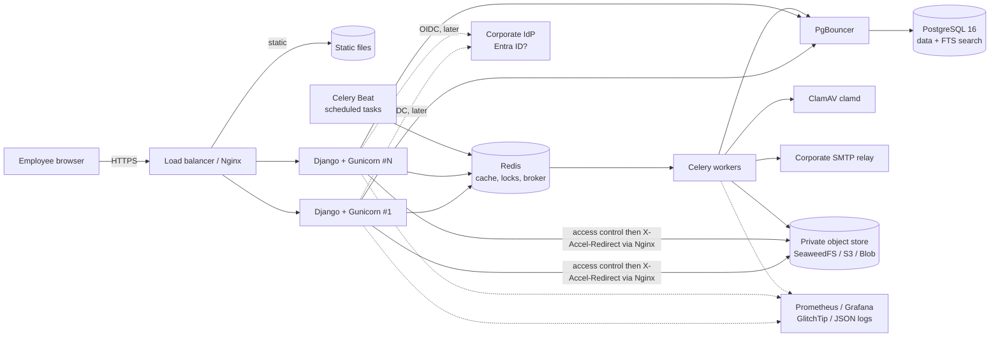
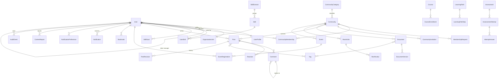

# TALAN Communities Platform — Framing document (step 1)

> Status: **proposal to be validated** · Date: 2026-10-09 · No line of code has been written yet.
> This document answers point 28 of the master prompt. The decisions marked **[TO BE VALIDATED]** are grouped in section 13.
> Update 2026-10-09: the project owner decided that everything in the project is written in English and that the application is bilingual (English by default + French); see H1 and D5.

---

## 1. Product vision summary

The platform is **the internal reference space** where a TALAN employee finds their community, the reliable knowledge it produces, and the path to grow. It is not a general-purpose social network: every interaction (post, lessons-learned report, question, event, quiz) serves **knowledge sharing** or **skills development**.

Three promises structure the product:

| For whom | Promise | Success indicator (to be measured, not promised) |
|---|---|---|
| Employee | "In 2 minutes I find the community, resource or training I need, and I see where I stand." | Share of employees who are members of ≥ 1 community; searches leading to a click |
| Community lead | "I run, structure and measure my community without any side tool." | Communities with ≥ 1 contribution/week; processing time of membership requests |
| Manager / Leadership | "I see my team's skills and training needs, aggregated and with respect for privacy." | Skills objectives defined; training participation |

Guiding principle: **few features, but truly operational ones** (persisted, authorized server-side, tested, documented).

---

## 2. Functional hypotheses retained

Hypotheses taken by default in order to move forward; each is reversible unless stated otherwise.

| # | Hypothesis | Why | Reversible? |
|---|---|---|---|
| H1 | **Bilingual interface, English (default) and French.** All UI strings go through Django's i18n system (gettext), `LANGUAGE_CODE` is `"en"`, and French is fully supported with a complete catalogue (checked in CI). The language is chosen from the user's saved preference, else the language cookie / browser `Accept-Language`, else English. User-written content is not translated. | Talan is of French origin and works in an international context; the i18n cost is almost nil when done from the start. Decided by the owner on 2026-10-09 (D5). | Yes |
| H2 | **Secure local authentication at the MVP**, architecture ready for **OIDC** (Microsoft Entra ID very likely) via `mozilla-django-oidc`. The account is identified by the professional e-mail. | No access to Talan's IdP for now; must not block development. | Yes (D2) |
| H3 | An employee belongs to **one organizational unit** and has **at most one direct manager** (simple hierarchical relationship, imported later from the directory). | Sufficient for manager rights; complex matrices later. | Yes |
| H4 | Three community **access modes**: *open* (free membership), *on request* (validation), *by invitation* (private, invisible to non-members except the title if configured). | Covers § 4.1. | Yes |
| H5 | **Published content** (post, lessons-learned report, document) belongs to a community; it inherits its visibility, unless a stronger restriction is set at object level. | Readable and testable authorization model. | Costly to change |
| H6 | Files are kept in a **private object store** (SeaweedFS in dev, managed S3-compatible in prod). No public URL; download goes through the application, which checks the right and then delegates sending to Nginx (**X-Accel-Redirect**, internal location): no storage URL is exposed. | Requirement § 5. | Yes |
| H7 | **Detailed quiz results** and self-assessment are **private by default**; the manager sees **aggregated** data for their team and, individually, only what the employee chose to share (declared skills, objectives, training followed). | Requirement § 3.3 + GDPR (minimization). | Yes (D6) |
| H8 | **No real time (WebSocket)** at the MVP: in-app notifications refreshed by HTMX (light 60 s polling) + asynchronous e-mails. Django Channels only if a real need appears. | § 15 "real time only if justified". | Yes |
| H9 | **Mentoring**, AI, Teams integration and directory synchronization are **out of the MVP**. | Value to be confirmed (§ 23). | Yes |
| H10 | Any badges are **non-competitive** (no named ranking). | § 23, avoid misleading comparisons. | Yes |
| H11 | An "**active user**" = has performed at least one authenticated action (page view included) over the period; we distinguish **active** (browses) from **contributor** (posts, comments, answers). Periods: day (DAU), 7 days (WAU), 28 days (MAU). | § 13 asks for a precise definition. | Yes |
| H12 | No real personal data outside production; generated demo datasets (Faker, fr_FR). | § 21, § 26.13. | Non-negotiable |
| H13 | **Visual identity**: in the absence of an official charter, we use a neutral theme driven by CSS *design tokens* (colors, typography) and a **logo placeholder**; no Talan logo is invented. | § 14. | Yes (D4) |

---

## 3. Main user journeys

**P1 — Employee's first steps.** Login → guided empty home page ("Choose 3 interests") → explained community suggestions ("because you indicated *Cloud*") → one-click join of an open community → the welcome feed fills up.

**P2 — Find a reliable resource.** Global search "dbt incremental" → results filtered by rights, highlighted terms, facets (type, community, date) → open the document: metadata, reference version, author → download (controlled, logged) or add to favorites.

**P3 — Join a private community.** Community page (title and description visible) → "Request to join" + motivation → notification to the lead → acceptance → notification to the requester → access to the content.

**P4 — Publish a lessons-learned report (REX).** "New REX" → choice of a template (context, problem, approach, results, lessons) → auto-saved draft → **automatic check** (detection of secrets, e-mails, client names from the sensitive list) → submission for review → validation by an expert/moderator → publication and notification of members.

**P5 — Run a community (lead).** Dashboard: pending requests, unanswered questions, reported content, content to review → batch processing → creation of an event with capacity and waiting list → pinning of an announcement.

**P6 — Event.** Calendar → "Advanced Terraform" workshop (20 seats) → registration → confirmation + .ics file → D-1 reminder (Celery) → withdrawal of a registrant → **automatic promotion** of the first person on the waiting list, notified.

**P7 — Skills development (release 2).** "Azure Data Engineer" path → ordered modules with prerequisites → progress computed server-side → timed mock test, answers saved at each question, idempotent submission → result, areas for improvement → internal certificate (clearly distinct from an official certification).

**P8 — Manager.** Team view: aggregated declared skills, gaps vs objectives, training participation → proposal of a learning objective to an employee → authorized CSV export (logged in the audit).

**P9 — Administration.** Functional admin: category management (no code), suspension of a community, reports queue, filtered audit log. Technical admin: separate space (`/ops/`), mandatory MFA, no access to business content by default.

---

## 4. Roles and permissions matrix

### 4.1 Two-level model

1. **Global roles** (platform scope): implemented with Django `Group` + `Permission`, administrable without code.
2. **Community roles** (object scope): `role` field on `CommunityMembership`.

Every access decision goes through a **single policy layer** (`core/policies/`): pure functions `can(user, action, obj) -> bool`, used by HTML views, the DRF API, querysets (`visible_to(user)`) and search. Templates only display a button if `can()` is true, **but the server systematically re-checks**. Each policy has its tests (role × action × state matrix).

### 4.2 Global roles

| Role | Description | Remarks |
|---|---|---|
| Pending activation | Account created, not activated | No access outside profile/help |
| Employee | Base role of every active employee | — |
| Manager | Employee + view of their direct reports | Defined by the hierarchical relationship, not assigned by hand |
| Training manager | Manages the training catalogue, paths, certifications | — |
| Community creator | Allowed to create a community | Otherwise creation goes through a request to the admin |
| Functional admin | Users, roles, communities, categories, global moderation, functional audit | No access to technical settings |
| Technical admin | Integrations, security, monitoring | No implicit functional rights; MFA; actions logged |
| Auditor | Read-only on audit and global statistics | No private content |

Group codes (Django `Group` names) are in English: `employee` (FR: Collaborateur), `community_creator` (FR: Créateur de communautés), `functional_admin` (FR: Admin fonctionnel), `technical_admin` (FR: Admin technique), `auditor` (FR: Auditeur).

### 4.3 Community roles

Member < Contributor < Expert < Moderator < Facilitator < Lead (each role inherits from the previous one). Trainer is an attribute of a training/event, not a community role.

### 4.4 Matrix (✓ allowed · ◐ conditional · — forbidden)

| Action | Non-member | Member | Contributor | Expert | Moderator | Facilitator | Lead | Manager | Functional admin | Technical admin | Auditor |
|---|---|---|---|---|---|---|---|---|---|---|---|
| View an open community and its content | ✓ | ✓ | ✓ | ✓ | ✓ | ✓ | ✓ | ✓ | ✓ | — | ✓ (meta) |
| View the content of a private community | — | ✓ | ✓ | ✓ | ✓ | ✓ | ✓ | — | ◐ ¹ | — | — |
| Join / request membership | ✓ | — | — | — | — | — | — | — | — | — | — |
| Publish a post / ask a question | — | ✓ | ✓ | ✓ | ✓ | ✓ | ✓ | — | — | — | — |
| Upload a document | — | ◐ ² | ✓ | ✓ | ✓ | ✓ | ✓ | — | — | — | — |
| Publish a REX (after review) | — | ✓ | ✓ | ✓ | ✓ | ✓ | ✓ | — | — | — | — |
| Validate a REX / a skill | — | — | — | ✓ | ✓ | ✓ | ✓ | — | ✓ | — | — |
| Moderate (hide, archive) | — | — | — | — | ✓ | ✓ | ✓ | — | ✓ | — | — |
| Pin, publish an announcement | — | — | — | — | — | ✓ | ✓ | — | ✓ | — | — |
| Create an event | — | — | — | ✓ | — | ✓ | ✓ | — | ✓ | — | — |
| Manage members, roles, requests | — | — | — | — | — | ◐ ³ | ✓ | — | ✓ | — | — |
| Configure / archive the community | — | — | — | — | — | — | ✓ | — | ✓ | — | — |
| Aggregated community statistics | — | — | — | — | — | ✓ | ✓ | — | ✓ | — | ✓ |
| View someone else's detailed quiz results | — | — | — | — | — | — | — | ◐ ⁴ | — | — | — |
| View an employee's skills | ◐ ⁵ | ◐ ⁵ | ◐ ⁵ | ◐ ⁵ | ◐ ⁵ | ◐ ⁵ | ◐ ⁵ | ◐ ⁴ | ✓ | — | — |
| Manage categories / taxonomies | — | — | — | — | — | — | — | — | ✓ | — | — |
| View the audit log | — | — | — | — | — | — | — | — | ◐ ⁶ | ◐ ⁶ | ✓ |
| Technical settings / integrations | — | — | — | — | — | — | — | — | — | ✓ | — |

1. Only through an entered reason (moderation, report) and logged in the audit.
2. If the community allows uploads by members (setting).
3. Accept/refuse requests; no modification of the Facilitator/Lead roles.
4. Manager: only for their direct reports and only what the employee has shared; detailed scores remain private unless explicitly consented to (H7).
5. According to the visibility chosen by the employee in their profile (private / community / whole company).
6. Functional admin: functional events; technical admin: technical and security events.

---

## 5. Proposed technical architecture and justification

**Style: Django modular monolith**, a single deployable code base, split into business applications with explicit boundaries (services, policies). Reason: small team, strong transactional consistency (memberships, registrations, attempts), simple deployment; extracting a service remains possible later (e.g. search) if a measurement justifies it.

| Component | Choice | Why | Alternative rejected |
|---|---|---|---|
| Language / framework | Python 3.12, **Django 5.2 LTS** | Long-term support (until April 2028), imposed by the prompt | — |
| API | **DRF** + **drf-spectacular** (OpenAPI 3) | Generated documentation, reuses the policies | GraphQL API: useless here |
| Frontend | Django templates + **Bootstrap 5.3** + **HTMX**; occasional vanilla JavaScript; **Chart.js** for charts | Fast, accessible server rendering, few dependencies; HTMX for interactions (reactions, filters, answer saving) without an SPA | React/Vue: maintenance cost and duplication of authorizations not justified |
| Database | **PostgreSQL 16** | Integrity, full-text search (`tsvector`, `french` config, `unaccent`, `pg_trgm`) | — |
| Connection pool | **PgBouncer** (transaction mode) in prod | Connection control with several Gunicorn instances + Celery | — |
| Cache / broker | **Redis 7** | Cache, locks, rate limiting, Celery broker | RabbitMQ: one more component with no gain at the MVP |
| Asynchronous tasks | **Celery 5** + Celery Beat | E-mails, antivirus scan, previews, reminders, analytical aggregates | — |
| File storage | **django-storages (S3)**; **SeaweedFS** in dev (MinIO is no longer distributed on Docker Hub) | S3-compatible / Azure Blob abstraction (via a dedicated backend) | Files in the database: excluded |
| Antivirus | **ClamAV** (`clamd`) called by Celery; file in *quarantine* until scanned | § 5 "detection of malicious files" | SaaS service: sends internal files outside |
| Server | **Gunicorn** (WSGI) behind **Nginx** | Proven; no ASGI as long as there is no real time | Uvicorn/ASGI: only if Channels |
| SSO | `mozilla-django-oidc` (ready, enabled when the IdP is available) | Standard OIDC, compatible with Entra ID | SAML: only if imposed |
| Security | `argon2` (hash), `django-axes` (anti brute force), `django-csp`, `django-ratelimit`, `django-otp` (admin MFA) | Covers § 18 with maintained building blocks | — |
| Observability | JSON logs (`structlog`), correlation ID, `django-prometheus`, Sentry SDK (compatible with self-hosted GlitchTip) | § 20; GlitchTip avoids sending errors outside the company | — |
| Tests | `pytest`, `pytest-django`, `factory_boy`, Playwright (journeys), **Locust** (load) | Locust is in Python: same language as the team | k6: also good, but JavaScript |
| Quality / CI | Ruff (lint + format), mypy (progressive), `pip-audit`, Bandit, Trivy (images), gitleaks | § 21 | — |
| Dependencies | **uv** + `pyproject.toml` + lock file | Reproducible and fast | pip-tools: equivalent |
| Deployment | Docker images; Compose for dev/test; **Kubernetes or managed container service** in pre-prod/prod (depending on D1) | Compose is not an HA solution | — |

### Key implementation decisions

- **Services layer**: every business write goes through `app/services.py` (transaction, policy check, audit, notification event). Views stay thin.
- **Audit**: `AuditEvent` written in the same transaction as the privileged action (append-only, no deletion through the application).
- **Notifications**: a `notify(event_type, recipients, target)` service creates `Notification` rows in the database; Celery sends the e-mails according to preferences and groups non-urgent categories into a daily digest.
- **Idempotence**: quiz submission and event registration protected by uniqueness constraints + `select_for_update` + an idempotency key on the form side.
- **Search**: `search_vector` column maintained by trigger/`SearchVectorField` + GIN index per content type; a unified search view queries each type through its `visible_to(user)` queryset (rights are applied **before** ranking, never as post-filtering of a page).

---

## 6. Architecture diagram



---

## 7. Initial entity-relationship diagram (MVP + training foundation)

Conventions: primary key `id` (bigint), `public_id` UUID exposed in URLs (no guessable sequential identifiers), `created_at`/`updated_at` everywhere, **logical archiving** (`archived_at`) rather than deletion for content; physical deletion reserved for GDPR requests (anonymization of authors).



### Main constraints and indexes

| Entity | Uniqueness / integrity constraints | Indexes | Deletion rule |
|---|---|---|---|
| `User` | unique `email` (case-insensitive, `citext` or `Lower` index) | email | Deactivation; GDPR anonymization |
| `CommunityMembership` | unique (`community`, `user`); `role` ∈ enumeration | (`user`, `community`), (`community`, `role`) | Leaving = row deletion + audit |
| `MembershipRequest` | a single `pending` request per (`community`, `user`) (partial unique index) | (`community`, `status`) | Kept 12 months then purged |
| `Community` | unique `slug` | `category`, `access_mode`, GIN `search_vector` | Archiving (`archived_at`), never `CASCADE` on content |
| `Post` | FK `community` `PROTECT`; `kind` ∈ {discussion, question, announcement, article} | (`community`, `-created_at`), (`pinned`), GIN `search_vector` | Archiving; hiding by moderation |
| `Comment` | depth limited to 2 levels (service validation) | (`post`, `created_at`) | Hiding |
| `Reaction` | unique (`user`, `post`, `kind`) | (`post`) | `CASCADE` with the post |
| `Document` | a single reference `DocumentVersion` (partial unique index `is_reference = true`) | (`community`, `type`), GIN `search_vector` | Archiving + expiry (`expires_at`) |
| `DocumentVersion` | unique `storage_key`; `sha256`, `size`, `mime`, `scan_status` | (`document`, `-created_at`) | S3 object deleted by a task after retention |
| `Event` | `capacity ≥ 0` (CHECK); `ends_at > starts_at` (CHECK); stored in UTC + `timezone` | (`community`, `starts_at`) | Cancellation (`cancelled_at`) |
| `EventRegistration` | unique (`event`, `user`); `status` ∈ {registered, waitlisted, cancelled, attended} | (`event`, `status`, `created_at`) | Kept for history |
| `AssessmentAttempt` | unique (`assessment`, `user`, `attempt_no`); unique `idempotency_key` | (`user`, `assessment`) | Kept according to the retention policy |
| `Notification` | — | (`recipient`, `read_at`, `-created_at`) | Purged after 90 days |
| `AuditEvent` | append-only (no UPDATE/DELETE through the app) | (`actor`, `created_at`), (`target_type`, `target_id`) | Retention 1 year (to be validated with IT) |

No generic JSON field in place of structuring relations. JSON is reserved for genuinely unstructured data (e.g. `AuditEvent.changes`, `Question.payload` specific to the question type).

---

## 8. Proposed Git repository structure

```
talan-communities/
├── README.md
├── pyproject.toml / uv.lock
├── .env.example                 # no secret value
├── docker/
│   ├── Dockerfile               # multi-stage, non-root user
│   ├── nginx/                   # reverse proxy conf
│   └── entrypoint.sh
├── compose.yaml                 # dev: web, worker, beat, postgres, redis, s3 (SeaweedFS), clamav, mailpit
├── compose.test.yaml
├── src/
│   ├── config/                  # settings/{base,dev,test,prod}.py, urls, wsgi, celery
│   ├── core/                    # policies, middleware (correlation), utilities, design system (base templates, components)
│   ├── accounts/                # User, profile, auth, OIDC, visibility preferences
│   ├── organizations/           # units, assignments, managerial relationship
│   ├── communities/             # communities, categories, memberships, invitations
│   ├── content/                 # posts, comments, reactions, tags, reports, moderation, REX, bookmarks
│   ├── documents/               # documents, versions, storage, scan, preview
│   ├── events/                  # events, registrations, waiting list, .ics
│   ├── learning/                # trainings, paths, progress, certifications   (release 2)
│   ├── skills/                  # framework, declared/validated skills, objectives (release 2)
│   ├── assessments/             # question bank, quizzes, attempts               (release 2)
│   ├── notifications/           # notifications, preferences, digests, e-mails
│   ├── search/                  # unified search
│   ├── analytics/               # aggregated indicators, dashboards, exports
│   └── audit/                   # AuditEvent, consultation
│       (each app: models.py, services.py, policies.py, selectors.py, views.py, api/, forms.py, tasks.py, templates/, tests/)
├── tests/                       # Playwright e2e, Locust load tests
├── docs/
│   ├── architecture.md, database.md, security.md, performance.md, deployment.md, runbooks/
│   └── decisions/               # ADR
└── .github/workflows/ci.yml
```

`REX` is part of `content` (a content type with a review workflow), and `mentorship` / `integrations` will be created when they become useful, so as not to multiply empty apps.

---

## 9. MVP backlog and roadmap

### 9.1 Proposed MVP ("Communities & knowledge") — work packages delivered in order

| Package | Content | Acceptance criteria (excerpts) | Depends on | Risks |
|---|---|---|---|---|
| **L0 Foundation** | Repository, Django 5.2, per-environment settings, Docker Compose (Postgres, Redis, SeaweedFS, ClamAV, Mailpit), CI (Ruff, tests, pip-audit, image build), JSON logs + correlation ID, `/healthz` | `docker compose up` starts everything; CI green; no secret variable in the repository | — | Hosting choice (D1) |
| **L1 Accounts & roles** | Custom User (e-mail), login/logout, password reset, anti brute force, profile, global roles, `policies` layer, audit, MFA for admins, 403/404/429/500 pages | A pending account sees nothing; an employee cannot access `/admin` (tested over HTTP, not only in the UI) | L0 | — |
| **L2 Design system** | Base template, role-adapted navigation, components (cards, empty states, toasts, accessible forms), brand tokens | Full keyboard navigation; AA contrast verified (axe-core in CI) | L1 | Missing charter (D4) |
| **L3 Communities** | Administrable categories, filterable catalogue, creation/configuration, 3 access modes, join / request / invitation / leave, internal roles, community home page | Matrix § 4.4 tested; a private community never appears in a result for a non-member | L1, L2 | — |
| **L4 Posts** | Posts (discussion, question, announcement), comments on 2 levels, reactions, mentions, pinning, revision history, reporting, moderation queue, bookmarks | Hiding by a moderator is audited; a non-member gets 404 on a private post | L3 | Spam / noise |
| **L5 Documents** | Upload (max size, MIME whitelist verified on content), ClamAV scan, quarantine, versions + reference version, metadata, tags, download via X-Accel-Redirect (Nginx), expiry, "outdated" report | An infected file (EICAR) is never downloadable; Nginx's internal location is not reachable from outside | L3 | Storage volume |
| **L6 REX & articles** | REX templates, auto-saved draft, secret/PII detection before submission, review → publication workflow | A REX containing a fake AWS key is blocked in review with an explicit message | L4, L5 | Detector false positives |
| **L7 Events** | Global and per-community calendar, capacity, waiting list with automatic promotion, cancellation, reminders, .ics export, video link, time zones | 2 simultaneous registrations for the last seat → 1 registered + 1 waitlisted (concurrent test) | L3 | — |
| **L8 Notifications** | In-app center, per-category preferences, asynchronous e-mails, daily digest | A web request never waits for SMTP sending; "disabled" preference respected | L4, L7 | SMTP deliverability |
| **L9 Search** | Unified FTS search (French), highlighting, facets, pagination, trigram suggestions, rights respected | No result from a private community for a non-member (dedicated test) | L3–L7 | Relevance |
| **L10 Dashboards** | Personalized employee home; lead dashboard (members, active, contributions, requests, unanswered questions); global admin dashboard | Indicators computed according to the H11 definitions; no named individual indicator on the lead side | L3–L9 | Cost of aggregates (nightly Celery tasks) |
| **L11 MVP hardening** | Demo data, Playwright tests of journeys P1–P6, Locust (reference scenario), tested backup/restore, documentation | See § 12 | All | — |

### 9.2 Roadmap after the MVP

| Release | Content |
|---|---|
| **R2 — Learning** | Skills framework (declared / self-assessed / validated), objectives, training catalogue, paths with prerequisites, persisted progress, quiz engine (single/multiple choice, true/false, short answer, ordering, matching, code), timed mock tests, internal certificates, manager dashboard |
| **R3 — Certifications & steering** | Certification catalogue, preparation, deadlines, declaration of certifications obtained; manual grading of written answers; analysis of recurring errors; CSV/PDF exports; attendance sheets and event feedback; recurring events |
| **R4 — Integrations** | OIDC SSO in production, directory import/synchronization, calendar and Teams integration, documented APIs for internal integrations |
| **R5 — Advanced collaboration** | Mentoring, non-competitive badges, explainable recommendations, community templates, automatic archiving of inactive communities |
| **R6 — AI (optional)** | Summaries and semantic search, only with a model hosted in a perimeter validated by security, and only on content the user can read |

---

## 10. Security and data protection strategy

**Target reference**: OWASP ASVS level 2 for exposed functions; OWASP Top 10 as a checklist in code review.

| Domain | Measures |
|---|---|
| Authentication | Argon2; password policy (length ≥ 12, check against compromised passwords using a local list); `django-axes` (progressive lockout); mandatory TOTP MFA for admins; OIDC SSO ready |
| Sessions | `Secure`, `HttpOnly`, `SameSite=Lax` cookies; 8 h inactivity expiry; session rotation at login; invalidation on account deactivation |
| Authorization | Single `policies` layer; `visible_to(user)` querysets; systematic matrix tests; 404 (not 403) for a private object so as not to reveal its existence |
| Inputs / outputs | Validated forms and serializers; ORM (no non-parameterized raw SQL); Markdown rendered then sanitized (`nh3`); strict CSP with nonce; HSTS, `X-Content-Type-Options`, `Referrer-Policy`, `Permissions-Policy` |
| Files | Private bucket; type whitelist verified on actual content; configurable max size; ClamAV; quarantine; `Content-Disposition: attachment` for non-previewable types; previews generated server-side, never any user HTML served inline |
| API | Session authentication (same origin); tokens only for integrations; CORS closed by default; rate limiting per user and per IP |
| Sensitive content | Detection before publication: secrets (patterns such as cloud keys, tokens, connection strings), e-mails/phone numbers, terms from an **administrable sensitive-client list**; blocked in review, never silent publication |
| Secrets | Environment variables / host's secrets manager; gitleaks in CI; never in images or logs (sensitive field filtering in logs) |
| Traceability | `AuditEvent` for any privileged action, export, role change, admin access to private content |
| Dependencies | `pip-audit`, Dependabot, Trivy on images; monthly updates |
| GDPR | Record of processing activities (purposes: community animation, skills development); minimization (no date of birth, no mandatory photo); profile visibility chosen by the user; right of access (export of their data) and erasure (anonymization of contributions); documented retention periods; **DPIA recommended** for skills data and manager access (to be carried out with Talan's DPO) |
| Incidents | Runbook: detection, containment (account deactivation, session revocation), DPO/CNIL notification within 72 h in case of personal data breach |

---

## 11. Performance strategy (10,000 registered users)

### 11.1 Load hypotheses (to be confirmed by measurement)

| Quantity | Hypothesis | Reasoning |
|---|---|---|
| Registered accounts | 10,000 (design target 20,000) | Margin × 2 |
| Daily actives (DAU) | 1,500 – 2,500 (15–25%) | Internal tool, not mandatory |
| Peak hour | 30% of DAU over 1 h, i.e. ~750 sessions | Peaks 9–10 am and 2 pm |
| Simultaneously active users (same minute) | 250 – 500 | ~1 action/20 s per active session |
| Peak throughput | 50 – 100 req/s (pages + HTMX calls) | Margin × 2: **sizing at 200 req/s** |
| Exceptional peak | Opening of registrations for a popular event: 1,000 users in 2 min | Specific concurrency test |
| Files | ~ 50,000 documents × 5 MB average ≈ 250 GB over 3 years | Max size per file: 100 MB (configurable) |
| Database | < 50 GB at 3 years excluding files | Notifications are purged |

**We do not claim to support 10,000 simultaneous connections**: that is not the realistic hypothesis, and no measurement has been made yet.

### 11.2 Initial measurable objectives (SLOs to be adjusted after tests)

- Authenticated pages: **p95 < 400 ms**, p99 < 1 s, at 200 req/s.
- 5xx error rate < 0.5% during the load test.
- Search: p95 < 600 ms.
- No endpoint > 20 SQL queries (safeguard tested with `django-assert-num-queries`).

### 11.3 Levers

Stateless application (sessions in database or Redis, files in S3) → **horizontal scaling** behind the load balancer; PgBouncer; `select_related` / `prefetch_related` and dedicated selectors; cursor pagination on feeds; Redis cache of costly fragments (counters, catalogue) with event-based invalidation; analytical aggregates pre-computed at night; gzip/brotli compression at Nginx level; fingerprinted static files with long cache; PostgreSQL `statement_timeout`; rate limiting; heavy tasks in Celery.

### 11.4 Load tests

Locust, realistic scenarios (70% feed/community reading, 15% search, 10% documents, 5% writing), dataset of 20,000 fictitious accounts, progressive ramp-up to the breaking point; report documenting observed bottlenecks and limits of the tested infrastructure (`docs/performance.md`).

---

## 12. MVP acceptance criteria

The MVP is accepted when, **with evidence (automated tests or an executed procedure)**:

1. A user logs in and only accesses authorized functions; the § 4.4 matrix (MVP scope) is covered by HTTP tests.
2. Communities: creation, configuration, 3 access modes, join/request/invitation/leave, internal roles: persisted and tested.
3. Posts, comments, reactions, pinning, reporting and moderation work and are audited.
4. Documents stored in a private bucket, scanned, versioned; no direct access without control (test of direct access to the bucket and to Nginx's internal location).
5. REX with review workflow and secret detection.
6. Events: capacity, waiting list, automatic promotion, cancellation, .ics; concurrency test green.
7. In-app notifications and asynchronous e-mails according to preferences.
8. Unified search respecting rights.
9. Employee, lead and admin dashboards computed according to the H11 definitions.
10. Migrations reproducible from an empty database (verified in CI); no automatic destructive migration.
11. CI green: lint, tests (coverage ≥ 85% on `services` and `policies`), pip-audit, gitleaks, image build, automated accessibility check.
12. Journeys P1–P6 tested in the browser (Playwright) on mobile, tablet and desktop.
13. PostgreSQL + object store backup, **restore tested** and documented.
14. Load test executed with report; deviations from the SLOs documented.
15. README and guides allowing a new developer to launch the project in under 30 minutes.

---

## 13. Risks, trade-offs and decisions to validate

### 13.1 Main risks

| Risk | Impact | Mitigation |
|---|---|---|
| Very broad scope (≈ 15 modules) | Unfinished features | Tight MVP, complete vertical packages, explicit roadmap |
| Low adoption ("yet another" platform) | Product failure | Start with 3–5 real pilot communities; measure |
| Leak of client information in REX | Legal, reputation | Detection + mandatory review + sensitive-client list |
| Manager access perceived as surveillance | Rejection, GDPR | Aggregated by default, sharing chosen by the employee, DPIA |
| No IdP at start | Local accounts to manage | OIDC ready, switchover without data migration |
| False positives of the secret detector | Frustration | Explicit message, human review, exceptions list |
| Hosting not defined | Delayed go-live | Agnostic containers, storage choice through configuration |

### 13.2 Structuring decisions to validate

| # | Decision | Default proposal |
|---|---|---|
| **D1** | Target production hosting (Azure, AWS, GCP, on-premise Kubernetes) | Agnostic containers; I assume **Azure** (Blob storage, PostgreSQL Flexible Server) if Talan is on Microsoft 365 |
| **D2** | Identity provider | Local auth at the MVP, Entra ID OIDC activatable as soon as access is granted |
| **D3** | MVP scope | "Communities & knowledge" (§ 9.1); learning and quizzes in R2 |
| **D4** | Official graphic charter (logo, colors, typography) | Neutral token-based theme in the meantime; to be replaced upon receipt |
| **D5** | Languages — **decided by the owner on 2026-10-09** | Bilingual: English (default, `LANGUAGE_CODE = "en"`) + French, both fully supported; language chosen from the user's saved preference, else the language cookie / browser `Accept-Language`, else English; every UI string goes through gettext and the French catalogue must be complete (checked in CI); user-written content is not translated |
| **D6** | Manager access rule to individual data | Aggregated by default; individual = direct reports + data shared by the employee; detailed scores never without consent |
| **D7** | Git repository for the code | New GitHub repository (to be created or attached to this project) |
| **D8** | Retention periods (audit, notifications, requests) | Audit 1 year, notifications 90 days, requests 12 months; to be validated with the DPO |

Once D3 and D7 are settled (the others can follow without blocking), I will write the detailed MVP specification, then the implementation plan for **work package L0 (technical foundation)**.
